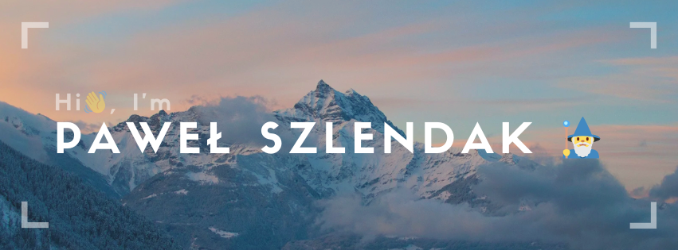

## About Me

I'm Paweł Szlendak, a passionate Front-End Developer with a rich background in marketing.

### 🔧 Technologies & Tools

- **Languages:** JavaScript, HTML, CSS (SCSS & Tailwind)
- **Frameworks:** React, Redux, Node.js, D3.js
- **Databases:** MySQL, PostgreSQL, Sequelize
- **Tools:** Git, VSCode

### 📜 Certificates
- [Responsive Web Design](https://www.freecodecamp.org/certification/shlendakh/responsive-web-design)
- [JavaScript Algorithms and Data Structures](https://www.freecodecamp.org/certification/shlendakh/javascript-algorithms-and-data-structures)
- [Front End Libraries](https://www.freecodecamp.org/certification/shlendakh/front-end-development-libraries)
- [Data Visualization](https://www.freecodecamp.org/certification/shlendakh/data-visualization)

### 🌱 Currently Working On

- **[soil-moisture-sensor](https://github.com/shlendakh/soil-moisture-sensor):** Simple Ardurino Project for handling maintenance of flowers in my apartamanet.
- **[toucan-nest](https://github.com/toucan-agency/toucan-nest):** This is Node.js & React project for marketing agencies for reporting data from Meta and Google Ads (for clients and specialist)
- ***[my-next-blog](https://github.com/shlendakh/my-next-blog):** Showcase of my TypeScript and Next.js skills (early stage, work-in-progress)

### 📫 How to Reach Me / Socials

### 

### 📈 GitHub Stats

  
  

